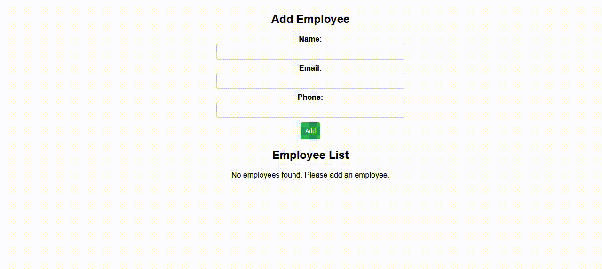

# Employee Management System



## Overview

The **Employee Management System** is a robust and user-friendly web application built with React. It facilitates efficient management of employee information, allowing users to add, edit, and delete employee records seamlessly. Leveraging modern web development practices, this application ensures scalability, maintainability, and an enhanced user experience.

## Features

- **Add Employees**: Easily add new employees with comprehensive details.
- **Edit Employees**: Update existing employee information effortlessly.
- **Delete Employees**: Remove employee records when necessary.
- **Form Validation**: Robust validation ensures data integrity using `react-hook-form` and `Yup`.
- **Persistent Storage**: Employee data is stored in `localStorage` for persistence across sessions.
- **Responsive Design**: Optimized for various devices and screen sizes for a consistent user experience.

## Technologies Used

- **React**: A JavaScript library for building interactive user interfaces.
- **React Router DOM**: For handling client-side routing and navigation.
- **React Context API**: To manage global state across the application without prop drilling.
- **React Hook Form**: For efficient and easy form handling.
- **Yup**: Schema builder for value parsing and validation.
- **PropTypes**: For runtime type checking of React props, enhancing reliability.
- **CSS Modules**: Scoped and maintainable styling to prevent CSS conflicts.
- **localStorage**: For client-side data persistence, ensuring data is retained across browser sessions.

## Installation

1. **Clone the Repository**

   ```bash
   git clone https://github.com/shimwillis/employee-management-system.git
   ```

2. **Navigate to the Project Directory**

   ```bash
   cd employee-management-system
   ```

3. **Install Dependencies**

   Ensure you have [Node.js](https://nodejs.org/) installed. Then run:

   ```bash
   npm install
   ```

4. **Start the Application**

   ```bash
   npm start
   ```

   The application will run on `http://localhost:3000` by default.

## Usage

1. **Add an Employee**

   - Navigate to the home page.
   - Fill in the employee details in the form.
   - Click the "Add" button to save the employee.

2. **View Employees**

   - All added employees are listed on the home page.
   - Click on an employee's name to view and edit their details.

3. **Edit Employee Details**

   - On the employee details page, update the necessary fields.
   - Click the "Update" button to save changes.

4. **Delete an Employee**

   - On the employee list, click the "Delete" button next to an employee to remove them from the list.

## Project Structure

```
employee-management-system/
├── public/
│   ├── assets/
│   │   └── preview.gif
│   ├── index.html
│   └── manifest.json
├── src/
│   ├── components/
│   │   ├── EmployeeForm.js
│   │   ├── EmployeeList.js
│   │   └── EmployeeDetails.js
│   ├── context/
│   │   └── EmployeeContext.js
│   ├── App.js
│   ├── App.css
│   ├── index.js
│   └── index.css
├── .gitignore
├── package.json
└── README.md
```

## Technologies and Libraries

- **React**: Core library for building the user interface.
- **React Router DOM**: Facilitates navigation between different components/views.
- **React Context API**: Provides a way to pass data through the component tree without having to pass props down manually at every level.
- **React Hook Form**: Simplifies form management and validation.
- **Yup**: Schema validation library for JavaScript objects, used here for form validation.
- **PropTypes**: Runtime type checking for React props to ensure components are used correctly.
- **CSS Modules**: Modular and reusable CSS with scoped class names to avoid conflicts.
- **localStorage**: Web storage API used to store employee data locally within the user's browser.

## Preview


## Contributing

Contributions are welcome! Please follow these steps:

1. **Fork the Repository**

2. **Create a Feature Branch**

   ```bash
   git checkout -b feature/YourFeature
   ```

3. **Commit Your Changes**

   ```bash
   git commit -m "Add your message"
   ```

4. **Push to the Branch**

   ```bash
   git push origin feature/YourFeature
   ```

5. **Open a Pull Request**

## License

This project is licensed under the [MIT License](LICENSE).

## Acknowledgements

- [Create React App](https://create-react-app.dev/) for bootstrapping the project.
- [React Hook Form](https://react-hook-form.com/) for efficient form handling.
- [Yup](https://github.com/jquense/yup) for validation schemas.
- [PropTypes](https://www.npmjs.com/package/prop-types) for runtime prop type checking.

---
